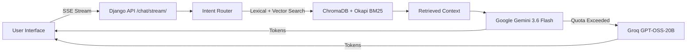

# 🎓 UniRAG PRO — Enterprise Hybrid RAG System for Bangladeshi Universities

[](https://www.python.org/)
[](https://www.djangoproject.com/)
[](https://ai.google.dev/)
[](https://groq.com/)
[](https://www.trychroma.com/)
[](#real-time-sse-token-streaming)

**UniRAG PRO** is a state-of-the-art Retrieval-Augmented Generation (RAG) platform specialized for Bangladeshi university admissions, GPA requirements, tuition fees, programs, and campus locations. It combines dense vector retrieval (`BAAI/bge-small-en-v1.5`), sparse lexical keyword matching (Okapi BM25), real-time Server-Sent Events (SSE) token streaming, low-latency LLM routing, and a ultra-modern glassmorphic UI.

---

## 🌟 Key Features

- **⚡ Real-Time SSE Token Streaming**: Experience live typewriter text rendering with sub-150ms time-to-first-token.
- **⚡ Dual LLM Provider Fallback**: Uses **Google Gemini 3.6 Flash** as primary engine with zero-delay fallback to **Groq (`openai/gpt-oss-20b`)** when API free quotas are exceeded.
- **🔍 Hybrid Vector & Lexical Retrieval**: Combines BM25 sparse keyword ranking with HuggingFace BGE dense vector search in ChromaDB SQLite store (2,964 indexed chunks across 205 university sources).
- **🎙️ Web Speech API Integration**: Built-in voice input for natural spoken questions.
- **📎 Multimodal File & Document Processing**: Drag-and-drop support for PDF documents, text files, and images with Gemini Vision OCR.
- **🎨 Glassmorphic Premium Interface**: Modern dark mode UI with interactive sample prompt cards, attachment chips, markdown formatting, syntax highlighting, and responsive mobile layout.

---

## 🏗️ Architecture & System Design

For a full technical breakdown of the multi-stage pipeline, router logic, and database schemas, see **[`SYSTEM_DESIGN.md`](./SYSTEM_DESIGN.md)**.



---

## 🛠️ In-Depth Architectural Pipeline

### 1. Scraping & Document Ingestion Pipeline
- **Web Crawler (`knowledge_base/web_sources.txt`)**: Automatically fetches raw web pages from university websites using `requests` and `BeautifulSoup`, stripping scripts, navigation headers, and footers to extract clean academic text.
- **PDF Processing (`knowledge_base/pdfs/`)**: Uses `PyPDF2` / `pdfplumber` to extract text from official university prospectuses, fee circulars, and admission policy documents.
- **Recursive Character Chunking**: Employs `RecursiveCharacterTextSplitter` configured with `chunk_size = 600` characters and `chunk_overlap = 100` characters. This preserves sentence boundaries and semantic continuity across adjacent chunks.
- **Dense Embedding Generation**: Computes 384-dimensional vector embeddings locally using `BAAI/bge-small-en-v1.5` via `HuggingFaceBgeEmbeddings` and persists vector indices into local ChromaDB (`chroma_store/`).

---

### 2. Celery Asynchronous Queue & Automated Ingestion
- **Task Broker & Worker**: Uses **Redis** (`REDIS_URL=redis://localhost:6379/0`) as message broker for background Celery workers (`ingestion_pipeline/tasks.py`), preventing long-running scraping tasks from blocking web requests.
- **Scheduled Automated Refresh**: Integrated with **Celery Beat** to periodically fetch web updates and re-index PDF documents on a recurring schedule without manual server re-indexing.
- **Freshness Metadata**: Exposes the `/status/` endpoint returning `last_updated` timestamp and source counts directly to the UI badge.

---

### 3. Memory Layer & Session Persistence (`rag/memory.py`)
- **Session Identification**: Unique `session_id` tracks user sessions across browser reloads.
- **Persistent Storage**: Stores conversation history in local SQLite/JSON store (`memory_store/`), preserving conversation history across server reboots.
- **Rolling Context Summarization**: Automatically condenses multi-turn conversations into a compact `conversation_summary`, maintaining key entities (e.g. student GPA, target department, university choices) while preventing context window bloat.

---

### 4. Context Engineering & Prompt Assembly (`rag/retriever.py` & `api/views.py`)
- **Smart Intent Classification**: Fast-path regex handles greetings instantly (< 5ms). Keyword matching routes factual questions directly to RAG retrieval without extra classification network calls.
- **Pronoun Resolution & Multi-Query Expansion**: Contextual follow-up queries containing pronouns (*"What are its fees?"*) resolve target entities (*"What are UIU's tuition fees?"*) using conversation memory.
- **Hybrid Retrieval Merge**: Merges dense vector similarity matches from ChromaDB with sparse keyword matches from Okapi BM25, ranking deduplicated chunks by highest relevance.
- **Prompt Engineering Guardrails**: Synthesizes retrieved context and conversation memory into a structured prompt with strict ground-truth rules, ensuring answers are formatted in clean Markdown with bolded key facts.

---

## 🚀 Quick Start Guide

### 1. Prerequisites
- Python 3.10+
- Git

### 2. Installation & Setup

```bash
# Clone the repository
git clone https://github.com/ArafathUIU/UniRAG_PRO.git
cd UniRAG_PRO

# Create virtual environment
python -m venv venv
venv\Scripts\activate  # Windows
# source venv/bin/activate # Linux/Mac

# Install dependencies
pip install -r requirements.txt
```

### 3. Environment Configuration

Create a `.env` file in the root directory:

```env
GEMINI_API_KEY=YOUR_GEMINI_API_KEY_HERE
GEMINI_MODEL=gemini-3.6-flash

GROQ_API_KEY=YOUR_GROQ_API_KEY_HERE
GROQ_MODEL=openai/gpt-oss-20b

DJANGO_SECRET_KEY=dev-only-secret-key
DJANGO_DEBUG=True
DJANGO_ALLOWED_HOSTS=*
```

### 4. Database Migration & Knowledge Ingestion

```bash
# Apply migrations
python manage.py migrate

# Ingest university sources into vector store
python ingest.py
```

### 5. Run Development Server

```bash
python manage.py runserver 0.0.0.0:8000
```

Open your browser at **`http://localhost:8000/`**.

---

## 🧪 Testing

Run the automated unit test suite:

```bash
python manage.py test tests
```

---

## 🌐 Production Deployment (Render / Vercel / Netlify)

For a detailed deployment breakdown comparing Render, Vercel, and Netlify, see **[`DEPLOYMENT.md`](./DEPLOYMENT.md)**.

### 🏆 Recommended: Render (1-Click Blueprint)

**Render** is the **best choice** for UniRAG PRO because it natively supports persistent Python WSGI/ASGI servers, background Celery workers, and persistent disk storage for local ChromaDB indices.

1. Fork or push your code to **GitHub**.
2. Log into **[Render Dashboard](https://dashboard.render.com/)** ➔ **New +** ➔ **Blueprint**.
3. Select **`UniRAG_PRO`**. Render will automatically detect `render.yaml` and configure the web service.
4. Set environment secrets (`GEMINI_API_KEY`, `GROQ_API_KEY`) and click **Apply**.

---

## 📜 License & Credits

Built by **[ArafathUIU](https://github.com/ArafathUIU)** for Bangladeshi higher education search & knowledge discovery.
