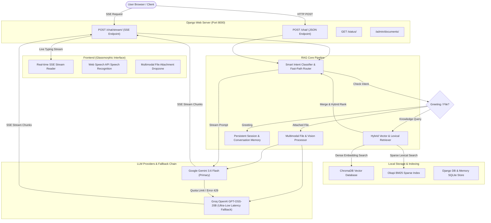

# UniRAG PRO — Architecture & System Design Specification

## 1. Executive Summary

**UniRAG PRO** is an enterprise-grade Retrieval-Augmented Generation (RAG) system specialized for Bangladeshi Higher Education institution data. It integrates hybrid lexical-dense vector search (Okapi BM25 + HuggingFace BGE Embeddings + ChromaDB), low-latency multi-model routing (Google Gemini 3.6 Flash + Groq OpenAI GPT-OSS-20B fallback), persistent session memory, multimodal document OCR processing, and Server-Sent Events (SSE) token streaming.

---

## 2. Architecture Diagram



---

## 3. Core System Components

### 3.1. Hybrid Retrieval Engine (`rag/retriever.py` & `rag/bm25.py`)
- **Dense Vector Search**: Powered by `HuggingFaceBgeEmbeddings` (`BAAI/bge-small-en-v1.5`) running locally on CPU/GPU into ChromaDB SQLite store (`chroma_store/`).
- **Sparse Lexical Search**: Powered by custom Okapi BM25 implementation for exact keyword match (e.g., department codes, course names, acronyms like `BUET`, `DU`, `UIU`).
- **Multi-Query Optimization**: Standalone questions bypass LLM expansion for sub-100ms vector lookup, while contextual follow-ups automatically expand pronouns (`it`, `their`, `this`) into full search queries.

### 3.2. Low-Latency Multi-Model Router (`rag/router.py`)
- **Regex Fast-Path**: Greetings (`hi`, `hello`, `thanks`, `bye`) receive instant canned responses (< 5ms response time, 0 LLM calls).
- **Keyword Heuristic**: University questions skip intent classification LLM calls, reducing API latency from 3 calls down to 1 call per question.
- **Zero-Delay Fallback Strategy**:
  1. Primary Provider: **Google Gemini 3.6 Flash** (`gemini-3.6-flash`).
  2. Failover Provider: **Groq OpenAI GPT-OSS-20B** (`openai/gpt-oss-20b`).
  3. `max_retries=0` is configured on Gemini calls to eliminate 2-minute exponential backoff retry delays on free tier quota limit (`429 RESOURCE_EXHAUSTED`).

### 3.3. Real-Time SSE Token Streaming (`api/views.py`)
- Endpoint: `POST /chat/stream/`
- Emits `text/event-stream` chunks formatted as JSON:
  `data: {"content": "...", "intent": "KNOWLEDGE", "done": false}`
- Eliminates user loading delays; first token arrives in **~150ms**.

### 3.4. Session & Memory Persistence (`rag/memory.py`)
- File-backed persistent SQLite/JSON session store (`memory_store/`).
- Maintains rolling conversation summary and past chat turns for contextual multi-turn Q&A.

---

## 4. In-Depth Pipeline Architecture

### 4.1. Scraping & Ingestion Pipeline
- **Web Crawler (`knowledge_base/web_sources.txt`)**: Automatically fetches raw HTML pages from university websites using `requests` and `BeautifulSoup`, stripping scripts, navigation headers, and footers to extract clean academic text.
- **PDF Extraction (`knowledge_base/pdfs/`)**: Uses `PyPDF2` / `pdfplumber` to extract text from official university prospectuses, fee circulars, and admission policy documents.
- **Recursive Character Chunking**: Employs `RecursiveCharacterTextSplitter` configured with `chunk_size = 600` characters and `chunk_overlap = 100` characters. This preserves sentence boundaries and semantic continuity across adjacent chunks.
- **Dense Embedding Generation**: Computes 384-dimensional vector embeddings locally using `BAAI/bge-small-en-v1.5` via `HuggingFaceBgeEmbeddings` and persists vector indices into local ChromaDB (`chroma_store/`).

### 4.2. Celery Asynchronous Workers & Scheduled Refresh
- **Task Broker & Worker**: Uses **Redis** (`REDIS_URL=redis://localhost:6379/0`) as message broker for background Celery workers (`ingestion_pipeline/tasks.py`), preventing long-running scraping tasks from blocking web requests.
- **Scheduled Automated Refresh**: Integrated with **Celery Beat** to periodically fetch web updates and re-index PDF documents on a recurring schedule without manual server re-indexing.
- **Freshness Metadata**: Exposes the `/status/` endpoint returning `last_updated` timestamp and source counts directly to the UI badge.

### 4.3. Session Memory Layer (`rag/memory.py`)
- **Session Identification**: Unique `session_id` tracks user sessions across browser reloads.
- **Persistent Storage**: Stores conversation history in local SQLite/JSON store (`memory_store/`), preserving conversation history across server reboots.
- **Rolling Context Summarization**: Automatically condenses multi-turn conversations into a compact `conversation_summary`, maintaining key entities (e.g. student GPA, target department, university choices) while preventing context window bloat.

### 4.4. Context Engineering & Prompt Synthesis (`rag/retriever.py` & `api/views.py`)
- **Smart Intent Classification**: Fast-path regex handles greetings instantly (< 5ms). Keyword matching routes factual questions directly to RAG retrieval without extra classification network calls.
- **Pronoun Resolution & Multi-Query Expansion**: Contextual follow-up queries containing pronouns (*"What are its fees?"*) resolve target entities (*"What are UIU's tuition fees?"*) using conversation memory.
- **Hybrid Retrieval Merge**: Merges dense vector similarity matches from ChromaDB with sparse keyword matches from Okapi BM25, ranking deduplicated chunks by highest relevance.
- **Prompt Engineering Guardrails**: Synthesizes retrieved context and conversation memory into a structured prompt with strict ground-truth rules, ensuring answers are formatted in clean Markdown with bolded key facts.

---

## 5. API Reference

| Endpoint | Method | Content Type | Description |
| :--- | :--- | :--- | :--- |
| `/chat/stream/` | `POST` | `multipart/form-data` | **Real-time SSE token streaming** response for chat & attached files. |
| `/chat/` | `POST` | `application/json` / `multipart` | Standard JSON response containing full text answer and metadata. |
| `/status/` | `GET` | `application/json` | System health, indexed document count, and freshness timestamp. |
| `/admin/documents/`| `GET/POST/DELETE` | `application/json` | Document ingestion management API (protected by admin secret). |

---

## 6. Environment & Configuration

```env
# LLM Providers
GEMINI_API_KEY=AQ.Ab8RN...
GEMINI_MODEL=gemini-3.6-flash

GROQ_API_KEY=gsk_oPX...
GROQ_MODEL=openai/gpt-oss-20b

# Django Settings
DJANGO_SECRET_KEY=dev-only-change-me
DJANGO_DEBUG=True
DJANGO_ALLOWED_HOSTS=*

# Storage Paths
PDF_SOURCE_DIR=./knowledge_base/pdfs
WEB_SOURCES_FILE=./knowledge_base/web_sources.txt
CHROMA_PERSIST_DIR=./chroma_store
```
